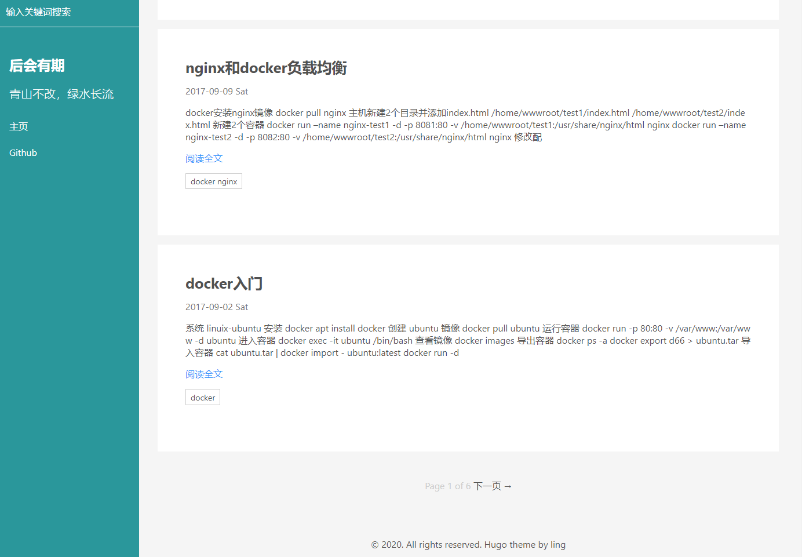

# hugo-theme-ling
基于[hyde](https://github.com/spf13/hyde) 修改的主题，增加了搜索、翻页等功能

## 截图


## 安装
```
$ cd your_site_repo/
$ mkdir themes
$ cd themes
$ git clone https://github.com/jangworn/hugo-theme-ling ling

```
## 启动
修改config.toml   
theme = "ling"
```
$ hugo server --buildDrafts
```
## 我的blog
[https://www.johnyn.com/](https://www.johnyn.com/)

## 我的config.toml
```
baseURL = "/"
languageCode = "zh-cn"
title = "后会有期"
theme="ling"
paginate = 10
paginatePath = "page"
hasCJKLanguage="true"
titleCaseStyle = "Go"
[permalinks]
  post = "/:year/:month/:day/:title/"
[params]
  themeColor = "theme-cyan"
  keywords = "Web开发技术，web开发，数据库相关，PHP相关，golang相关，docker相关，git相关"
  description = "基于Hugo,专注Web开发技术分享,包括数据可视化，前端、数据库、PHP、golang、Elasticsearch等"
  subTitle = "青山不改，绿水长流 carpe diem"
  qrcode = "/img/qrcode.jpg"
[Menus]
  main = [
      {Name = "Github", URL = "https://github.com/jangworn/"}
  ]
[markup]
  [markup.highlight]
    codeFences = true
    guessSyntax = true
    hl_Lines = ""
    lineNoStart = 1
    lineNos = true
    lineNumbersInTable = false
    noClasses = true
    style = "monokai"
    tabWidth = 4
[outputs]
  home = ["HTML", "RSS", "JSON"]

```